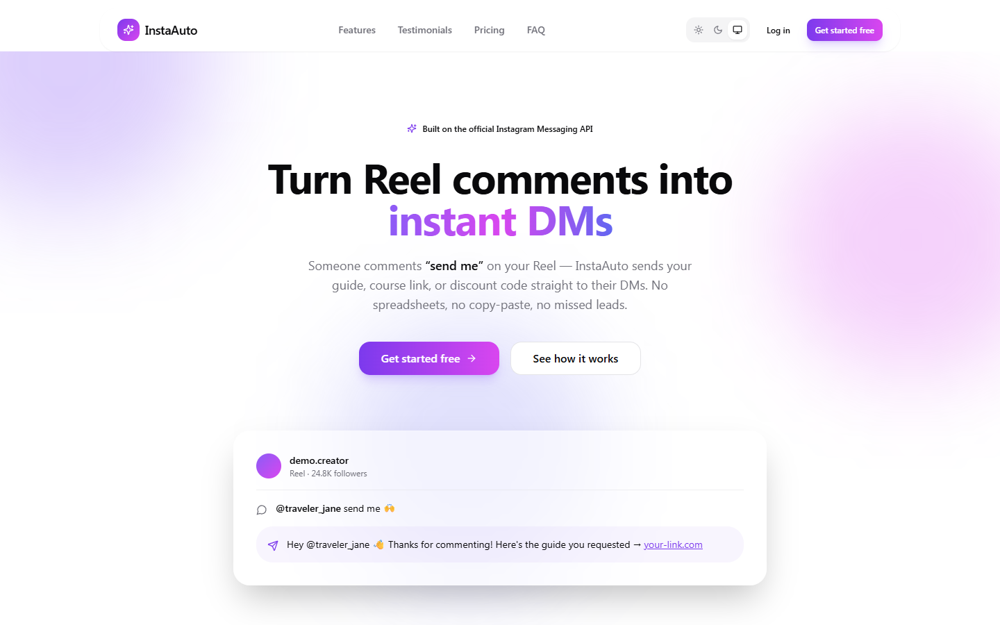
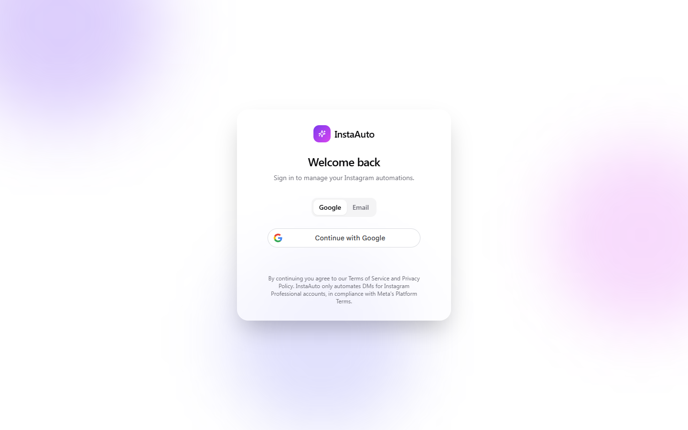
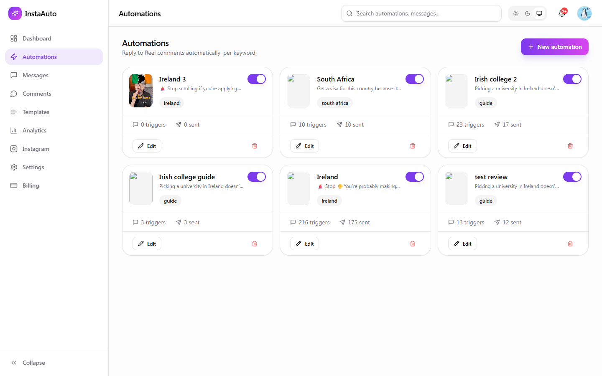
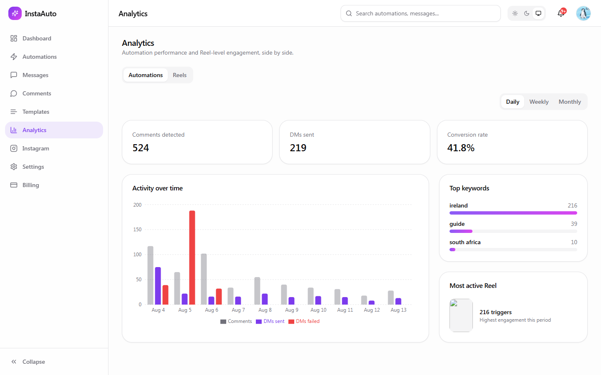

<p align="center">
  
  
  
  
  
  
  
</p>

<h1 align="center">📸 InstaAuto</h1>

<p align="center">
  <strong>Open-source Instagram comment-to-DM automation — a self-hosted ManyChat alternative built on the official Meta Graph API.</strong>
</p>

<p align="center">
  Automate Instagram DM replies when someone comments a trigger keyword on one of your Reels or posts —
  no scraping, no unofficial endpoints, just the Instagram Messaging API and Webhooks Meta actually supports.
  <br />
  No monthly SaaS fees. No vendor lock-in. Your data stays in your own Postgres database.
</p>

> Comment **"send me"** on a Reel → InstaAuto automatically sends:
> _"Hey 👋 Thanks for commenting! Here is the guide you requested. https://your-link.com"_

<p align="center">
  <a href="#local-development"><strong>Quick Start</strong></a> ·
  <a href="#-features"><strong>Features</strong></a> ·
  <a href="#3-configure-environment"><strong>Env Setup</strong></a> ·
  <a href="#going-live-with-real-instagram-automation"><strong>Going Live</strong></a> ·
  <a href="#-faq"><strong>FAQ</strong></a> ·
  <a href="#-roadmap"><strong>Roadmap</strong></a> ·
  <a href="https://github.com/vaibhavhariramani/instaauto/discussions"><strong>Discussions</strong></a>
</p>

**Live demo app:** [instaautomation-1da00.web.app](https://instaautomation-1da00.web.app)

---

## 💡 Why not just use ManyChat?

| Feature | ManyChat | InstaAuto |
|---|---:|---:|
| Open source | ❌ | ✅ |
| Self-hosted | ❌ | ✅ |
| Monthly SaaS fee | ✅ | ❌ (self-host) |
| Own your database | ❌ | ✅ |
| Official Meta Graph API only (no scraping) | ✅ | ✅ |
| AES-256-GCM encrypted token storage | ❌ (opaque) | ✅ |
| Built-in analytics dashboard | Paid tiers | ✅ |
| Full source code access | ❌ | ✅ |

**Positioning:** InstaAuto is not a drop-in clone of ManyChat — it's a smaller, focused, self-hosted base for comment-to-DM automation that you can run, audit, and extend yourself.

---

## ✨ Features

- **Comment-to-DM automation** — trigger keywords on specific posts/Reels or globally, with dedupe so the same commenter isn't DMed twice
- **Automation builder** — create, edit, and toggle keyword-matched automations from the dashboard
- **Live inbox** — view and manually reply to Instagram conversations
- **Message templates** — reusable DM templates for automations and manual replies
- **Analytics dashboard** — automation performance, messages sent, and daily/rolling rollups
- **Notifications** — in-app alerts for automation activity
- **Instagram connection management** — Instagram Login (Business/Creator accounts), token refresh, mock mode for demoing without a reviewed Meta App
- **Stripe billing** — subscription tiers (Starter/Pro/Business, monthly/yearly) with a self-serve billing page
- **Google Sign-In** — auth via Google OAuth, JWT sessions with rotating refresh tokens

---

## Screenshots

| Landing | Login |
| --- | --- |
|  |  |

| Automations | Analytics |
| --- | --- |
|  |  |

---

## Stack

| Layer      | Tech                                                                                     |
| ---------- | ----------------------------------------------------------------------------------------- |
| Frontend   | React 19, TypeScript, Vite, Tailwind CSS, Framer Motion, React Router, React Query, Zustand, React Hook Form + Zod, shadcn/ui-style components, Recharts, Lucide |
| Backend    | Node.js, Express, TypeScript, Prisma ORM, PostgreSQL, JWT auth, Google OAuth, Stripe       |
| Deployment | Firebase Hosting (frontend) + Firebase Cloud Functions v2 (backend), GitHub Actions CI     |

## Monorepo layout

```
automation/
├── apps/
│   ├── web/                 # React + Vite frontend
│   └── functions/           # Express API, wrapped as a Firebase Cloud Function
├── packages/
│   └── shared/              # Shared Zod schemas, enums, constants, DTO types
├── firebase.json            # Hosting rewrites + Functions config
└── .github/workflows/ci.yml
```

---

## Why Instagram automation is built this way

Instagram does **not** allow arbitrary automated DMs from generic bots. InstaAuto only works
within Meta's supported, compliant surface:

- Requires an **Instagram Professional (Business or Creator)** account, connected via **Instagram
  Login** (no linked Facebook Page required).
- Uses the **Instagram Webhooks** `comments` field to detect new comments in real time.
- Replies via the **Private Replies API** (`POST /{ig-comment-id}/private_replies`) — the
  endpoint Meta specifically built for "reply to this comment via DM," rather than the generic
  Send API (which is restricted outside a 24-hour customer-service window).
- Verifies every inbound webhook with the `X-Hub-Signature-256` HMAC signature before processing.
- Never scrapes, automates a browser, or touches unofficial endpoints.

Because a live Meta App requires App Review and a real Instagram Business account, the backend
ships with an **`INSTAGRAM_MOCK_MODE`** (on by default) that fabricates a connected account and
lets you fire synthetic comments through the *real* automation/matching/DM pipeline from the UI
(Automations → **Simulate comment**). Flip it off once you have real Meta credentials.

---

## Local development

### 1. Prerequisites

- Node.js 20+
- A Postgres database — create a free one on [Neon](https://neon.tech) or [Supabase](https://supabase.com)
  and copy its connection string (used locally and in production, so no local Postgres install needed)

### 2. Install

```bash
npm install
```

### 3. Configure environment

```bash
cp apps/functions/.env.example apps/functions/.env
cp apps/web/.env.example apps/web/.env
```

Generate the required secrets:

```bash
node -e "console.log(require('crypto').randomBytes(48).toString('hex'))"   # JWT_ACCESS_SECRET
node -e "console.log(require('crypto').randomBytes(48).toString('hex'))"   # JWT_REFRESH_SECRET
node -e "console.log(require('crypto').randomBytes(32).toString('hex'))"   # ENCRYPTION_KEY (32 bytes)
```

Set `DATABASE_URL` in `apps/functions/.env` to your Neon/Supabase connection string.

Set `GOOGLE_CLIENT_ID` (backend) and `VITE_GOOGLE_CLIENT_ID` (frontend) from a Google Cloud
[OAuth 2.0 Client ID](https://console.cloud.google.com/apis/credentials) of type **Web application**.
Leave `INSTAGRAM_MOCK_MODE=true` and the Meta/Stripe vars empty to run in demo mode.

#### Full environment variable reference

**Backend — `apps/functions/.env`** (see `apps/functions/.env.example` for inline setup notes):

| Variable | Required | Description |
|---|---:|---|
| `NODE_ENV` | ✅ | `development` locally, `production` when deployed |
| `PORT` | ✅ | API port (default `4000`) |
| `FRONTEND_URL` | ✅ | Origin allowed by CORS (e.g. `http://localhost:5173`) |
| `COOKIE_DOMAIN` | Optional | Domain scope for auth cookies in production |
| `DATABASE_URL` | ✅ | Pooled Postgres connection string (Neon/Supabase) |
| `DIRECT_URL` | ✅ | Direct (non-pooled) Postgres connection, used only by `prisma migrate` |
| `JWT_ACCESS_SECRET` | ✅ | Random secret for signing access tokens — generate with the command above |
| `JWT_REFRESH_SECRET` | ✅ | Random secret for signing refresh tokens |
| `ENCRYPTION_KEY` | ✅ | 32-byte hex key used for AES-256-GCM encryption of stored Instagram tokens |
| `GOOGLE_CLIENT_ID` | ✅ | Google OAuth Client ID (server-side verification) |
| `INSTAGRAM_MOCK_MODE` | ✅ | `true` to demo the full pipeline without a reviewed Meta App; `false` for real Instagram |
| `META_APP_ID` | Required for real IG | Instagram app ID from Meta Developer Console |
| `META_APP_SECRET` | Required for real IG | Instagram app secret for token exchange |
| `META_VERIFY_TOKEN` | Required for real IG | Any string you choose; must match the webhook subscription form |
| `META_REDIRECT_URI` | Required for real IG | OAuth redirect URI, must match Meta app settings exactly |
| `STRIPE_SECRET_KEY` | Optional | Enables billing; routes return `503` until set |
| `STRIPE_WEBHOOK_SECRET` | Optional | Verifies incoming Stripe webhook signatures |
| `STRIPE_PRICE_*` (6 vars) | Optional | Price IDs for Starter/Pro/Business × monthly/yearly |

**Frontend — `apps/web/.env`** (see `apps/web/.env.example`):

| Variable | Required | Description |
|---|---:|---|
| `VITE_GOOGLE_CLIENT_ID` | ✅ | Same Google OAuth Client ID as the backend |
| `VITE_API_URL` | Optional | Override the API base URL; defaults to same-origin `/api` |
| `VITE_INSTAGRAM_MOCK_MODE` | ✅ | Must match the backend's `INSTAGRAM_MOCK_MODE` — controls the "Simulate comment" demo affordance |

**Security note:** never expose `JWT_ACCESS_SECRET`, `JWT_REFRESH_SECRET`, `ENCRYPTION_KEY`, `META_APP_SECRET`, `STRIPE_SECRET_KEY`, `STRIPE_WEBHOOK_SECRET`, or `DATABASE_URL` in client-side code or commit them anywhere — they belong only in `.env` files (gitignored) or your host's secret manager.

### 4. Database

```bash
npm run prisma:generate -w apps/functions
npm run prisma:migrate -w apps/functions
npm run prisma:seed -w apps/functions
```

The seed script creates a demo user, a mock-connected Instagram account, sample templates,
automations, messages, and 30 days of analytics so the dashboard isn't empty on first run.

### 5. Run

```bash
npm run dev
```

- Frontend: http://localhost:5173
- API: http://localhost:4000 (proxied through Vite at `/api`)

Sign in with any Google account, complete onboarding, click **Connect Instagram** (instant in
mock mode), create an automation, then use **Simulate comment** on the Automations page to watch
a comment flow through matching → dedupe → DM send → Messages inbox → notification, end to end.

---

## Going live with real Instagram automation

1. Create a [Meta App](https://developers.facebook.com/apps) with the **Instagram** product (API
   with Instagram Login) and **Webhooks** added.
2. Add scopes: `instagram_business_basic`, `instagram_business_manage_comments`,
   `instagram_business_manage_messages`.
3. Submit for **App Review** for the above permissions (required for anything beyond your own
   test accounts).
4. Set a webhook subscription (`comments` field) pointing at
   `https://<your-domain>/api/webhooks/instagram`, with a `META_VERIFY_TOKEN` of your choosing.
5. Set in `apps/functions/.env`:
   ```
   INSTAGRAM_MOCK_MODE=false
   META_APP_ID=...
   META_APP_SECRET=...
   META_VERIFY_TOKEN=...
   META_REDIRECT_URI=https://<your-domain>/api/instagram/oauth/callback
   ```
   And set `VITE_INSTAGRAM_MOCK_MODE=false` in `apps/web/.env` too — the two flags are independent
   and both must be `false` together, or the frontend's mock-only "Simulate comment" affordance can
   still appear even though the backend is live.
6. Connect an Instagram **Professional** account via Instagram Login from the app's Instagram
   settings page.

## Stripe billing (optional)

1. Create products/prices in Stripe for each plan tier (Starter/Pro/Business × monthly/yearly).
2. Set `STRIPE_SECRET_KEY`, `STRIPE_WEBHOOK_SECRET`, and the six `STRIPE_PRICE_*` env vars.
3. Point a Stripe webhook at `https://<your-domain>/api/webhooks/stripe` listening for
   `checkout.session.completed`, `customer.subscription.updated`, `customer.subscription.deleted`.

Until these are set, billing routes respond `503` with a clear message instead of crashing.

---

## CI/CD

`.github/workflows/ci.yml` runs on every push/PR: install → build shared package → lint →
typecheck → Prisma generate/migrate against an ephemeral Postgres → test → build. On pushes to
`main` that pass, a second `deploy` job applies Prisma migrations against the production
database, builds the frontend, and deploys Hosting + Functions to
[instaautomation-1da00.web.app](https://instaautomation-1da00.web.app) using a dedicated
`github-actions-deploy` GCP service account (scoped to Firebase Hosting/Functions/Cloud Run/
Artifact Registry — no broader project access) whose key is stored only as the
`FIREBASE_SERVICE_ACCOUNT` GitHub Actions secret. Production env values live in the
`FUNCTIONS_ENV_PRODUCTION` and `WEB_ENV_PRODUCTION` secrets and are written to the (gitignored)
`.env` files the build expects right before building/deploying.

## Deploying to Firebase manually

```bash
npm install -g firebase-tools
firebase login
firebase use --add          # select/create your Firebase project, update .firebaserc
```

Set production secrets on the Functions runtime (2nd-gen functions read `.env` files per
codebase, or use `firebase functions:secrets:set` for sensitive values):

```bash
firebase functions:secrets:set JWT_ACCESS_SECRET
firebase functions:secrets:set JWT_REFRESH_SECRET
firebase functions:secrets:set ENCRYPTION_KEY
firebase functions:secrets:set DATABASE_URL
# ...repeat for GOOGLE_CLIENT_ID, META_*, STRIPE_* as needed
```

Then build and deploy:

```bash
npm run build
firebase deploy --only hosting,functions
```

`firebase.json` rewrites `/api/**` to the `api` function and serves the SPA for everything else,
so frontend and backend share one domain in production — no CORS configuration needed.

**Database**: Cloud Functions are stateless/serverless, so point `DATABASE_URL` at a
connection-pooled managed Postgres (e.g. [Neon](https://neon.tech) or
[Supabase](https://supabase.com)) rather than a self-managed instance — the same one you set up
for local dev works fine, or create a separate production database. Run
`npm run prisma:deploy -w apps/functions` against production before your first deploy.

---

## Scripts (run from repo root)

| Command                  | Description                                  |
| ------------------------- | --------------------------------------------- |
| `npm run dev`              | Run frontend + API concurrently in watch mode |
| `npm run build`            | Build shared package, frontend, and API       |
| `npm run lint`              | ESLint across both apps                        |
| `npm run typecheck`         | Strict TypeScript project builds               |
| `npm run test`              | Vitest unit tests for both apps                |
| `npm run prisma:migrate`    | Create/apply a dev migration                   |
| `npm run prisma:seed`       | Seed demo data                                 |

## Security notes

Helmet, scoped CORS, per-route rate limiting, Zod validation on every mutating endpoint,
parameterized Prisma queries, AES-256-GCM encryption of stored Instagram access tokens, rotating
JWT refresh sessions (revocable via the `Session` table), an `AuditLog` for sensitive actions, and
signature verification (HMAC for Meta, Stripe SDK verification for Stripe) before any webhook
payload is processed.

---

## 🗺️ Roadmap

- [ ] Story mention/reply automation
- [ ] Multi-account workspace support
- [ ] Automation templates library (pre-built keyword flows)
- [ ] Webhook event debugger in the dashboard
- [ ] Export/import automations
- [ ] One-click deploy button (Firebase/Render)
- [ ] Docker Compose setup for local dev

Have an idea? Open a [Discussion](https://github.com/vaibhavhariramani/instaauto/discussions) or an [Issue](https://github.com/vaibhavhariramani/instaauto/issues).

---

## ❓ FAQ

### Is there a free, self-hosted alternative to ManyChat for Instagram?

Yes — InstaAuto is open source under the MIT license. Self-host it on Firebase (or any Node host) with your own Postgres database and Meta app, and you get comment-to-DM automation, a live inbox, templates, and analytics without a recurring SaaS fee.

### Is this allowed by Instagram / Meta?

Yes — InstaAuto only uses the official Instagram Graph API, Instagram Login, and the Private Replies API that Meta built specifically for comment-to-DM flows. It doesn't scrape, automate a browser, or bypass Meta's messaging window rules. You still need to complete Meta's App Review for `instagram_business_manage_comments` and `instagram_business_manage_messages` before using it on real (non-tester) accounts.

### Do I need to pay for anything to self-host it?

No — a Neon/Supabase free-tier Postgres database and Firebase's free Spark/Blaze usage tier comfortably run a single creator or small-business account. Stripe billing is only needed if you want to charge your own users for access.

### What is `INSTAGRAM_MOCK_MODE` for?

Getting a Meta App through review takes time. Mock mode fabricates a connected Instagram account so you can exercise the full automation → matching → DM → inbox pipeline from the UI (Automations → **Simulate comment**) before you have real Meta credentials.

### Can I use a different database or hosting provider?

The backend is a standard Express app behind Prisma/Postgres, so it can run on any Node host (Render, Railway, Fly.io, a VPS, etc.) instead of Firebase Cloud Functions — you'd just skip the `firebase.json` rewrites and serve the frontend build separately or behind your own reverse proxy.

---

## 🤝 Contributing

Contributions are welcome — bug fixes, docs improvements, and new automation features.

- Open an [Issue](https://github.com/vaibhavhariramani/instaauto/issues) for bugs or feature requests
- Start a [Discussion](https://github.com/vaibhavhariramani/instaauto/discussions) for questions or ideas
- Good first issues: improve setup docs, add Docker support, add tests for API routes, improve webhook logging, roadmap items above

---

## ❤️ Sponsors

No sponsors yet — if InstaAuto saves you money over a paid automation tool, consider sponsoring the project via [GitHub Sponsors](https://github.com/sponsors/vaibhavhariramani).

## ⭐ Support

If this project is useful to you, please star the repo — it helps other developers find a free, self-hosted alternative to paid Instagram automation tools.

---

## 📄 License

[MIT](LICENSE) — use it, fork it, self-host it, customize it, and build on top of it.
